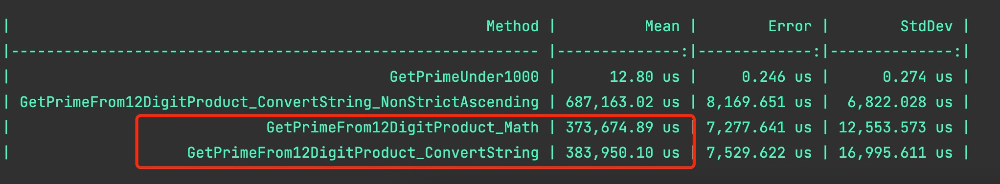

# Prime Number

This is to calculate 4 prime numbers, which under 1000 and the product of them are 12 digit number, 
which has ascending order for each digit.

## Structure
1. PrimeNumber - console app to calculate the prime numbers.
2. PrimeNumber.Test - unit test
3. PrimeNumber.Performance.Benchmarker - performance test

## Summary of the PrimeNumber
1. PrimeFinder - find all the prime numbers under 1000
2. ProductFilter - find the 4 prime numbers fit the condition.

You may notice there're 3 methods to find the response.
FilterProductViaStringConvert - this method use string convert to get each digit of the product, print restricted ascending result.
FilterProductUseMathMethod - this method use math method to get each digit of the product, print restricted ascending result.
FilterProduct - this method is the init version, which also use string convert, print non-restricted ascending results. ex: 111111111499

## Final result
There're 4 products fit the non-restricted Ascending condition :
product : 111111111499 , primes: 167 719 953 971
product : 123334444567 , primes: 313 563 811 863
product : 113348999999 , primes: 353 563 643 887
product : 111111133667 , primes: 397 433 797 811
There're 1 products fit the condition - math method :
product : 123334444567 , primes: 313 563 811 863
There're 1 products fit the condition - string convert method :
product : 123334444567 , primes: 313 563 811 863 

## Time consumed
FilterProductViaStringConvert - about 383ms
FilterProductUseMathMethod - about 373ms
FilterProduct - about 687ms

Notice: if you want to run PrimeNumber.Performance.Benchmarker , please select release when you run it.